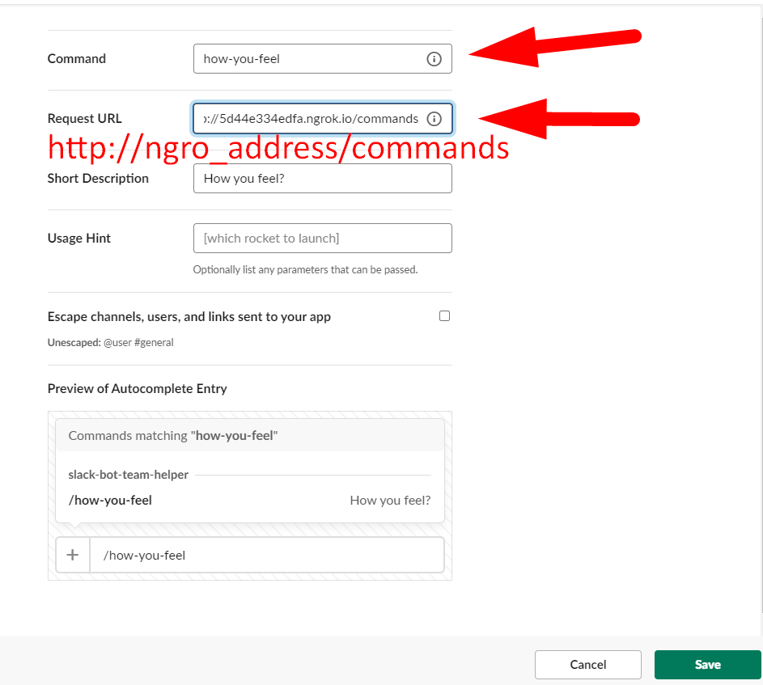

# Slack App

[](https://packagist.org/packages/token27/slack-bot-team-helper)
[](https://php.net/)
[](https://packagist.org/packages/token27/slack-bot-team-helper)
[](https://packagist.org/packages/token27/slack-bot-team-helper)

## Credentials

Go to [create new slack app](https://api.slack.com/apps?new_app=1)

### Setup your app name and workspace


### Setup your app functionality

- Bots
- Permissions
- Slash Commands
- Event Subscriptions
- Interactive Components.


## Scopes & Permissions

### Bot Token Scopes

    app_mentions:read
    chat:write
    commands
    channels:read
    channels:join
    channels:manage
    groups:read
    incoming-webhook
    users:read
    users.profile:read
    users:read.email

### User Token Scopes

    channels:history
    channels:read
    groups:history
    groups:read
    im:read
    im:history
    chat:write
    links:write
    users:read
    users:read.email
    identity.email


## Configure With NGROK

```
    npm start    
```


```
    npm run ngrok    
```


### Interactions


### Commands

    how-you-feel
    work-place
    project-change-status




## Events


### Bot events

    app_mention
    member_joined_channel
    message.im
    message.channels
    message.groups
    team_join


### Workspace events

    im_close
    im_created
    im_open
    member_joined_channel
    message.im
    message.channels
    message.groups
    team_join


### App Credentials

(Basic Information)


### Generate App Token Level

(Basic Information)


